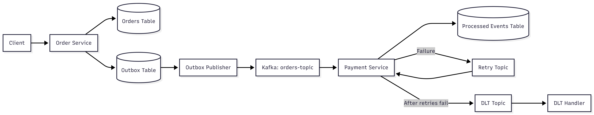

# 🚀 Kafka-Based Order Processing System (Event-Driven Microservices)

## 📌 Overview

This project demonstrates a **production-style event-driven architecture** using Apache Kafka with strong focus on **reliability, fault tolerance, and data consistency**.

It simulates an order-payment system where events are processed asynchronously and safely, even under failures.

---

## 🏗️ Architecture

```text
Client
  ↓
Order Service (Producer + Outbox)
  ↓
Outbox Table (DB)
  ↓
Outbox Publisher (Scheduler)
  ↓
Kafka (orders-topic)
  ↓
Payment Service (Consumer)
  ↓
Retry Topics → Dead Letter Topic (DLT)
  ↓
DLT Handler
```

## 🏗️ Architecture Diagram


---

## 🔁 End-to-End Flow

1. Client sends order request
2. Order Service:

    * Saves order in DB
    * Stores event in **Outbox table (same transaction)**
3. Outbox Publisher:

    * Reads NEW events
    * Publishes to Kafka
    * Marks as SENT
4. Payment Service:

    * Consumes event
    * Processes payment
5. On failure:

    * Retries with backoff
    * After max retries → moves to DLT
6. Idempotency ensures:

    * Duplicate events are ignored safely

---

## ⚙️ Tech Stack

* Java 17
* Spring Boot
* Spring Kafka
* PostgreSQL
* Docker

---

## 🔥 Key Features

### 🟢 1. Event-Driven Architecture

* Loose coupling between services
* Asynchronous communication via Kafka

---

### 🔁 2. Retry with Backoff

* Implemented using `@RetryableTopic`
* Handles transient failures automatically

---

### ☠️ 3. Dead Letter Topic (DLT)

* Failed messages routed after retries
* Dedicated DLT handler for debugging/recovery

---

### 🔒 4. Idempotent Consumer

* Prevents duplicate processing
* Uses `processed_events` table
* Ensures safe re-delivery handling

---

### 📦 5. Outbox Pattern (CRITICAL FEATURE)

Ensures **DB + Kafka consistency**

#### Problem:

```text
DB saved but Kafka failed → data inconsistency ❌
```

#### Solution:

```text
Save Order + Save Event (same transaction)
↓
Publisher sends event asynchronously
```

#### Benefit:

```text
✔ No data loss
✔ Guaranteed event delivery
✔ Production-grade reliability
```

---

## 🧠 Idempotency Design

```text
1. Check if orderId exists in processed_events
2. If exists → ignore
3. Else → process and store
```

---

## 🗄️ Database Schema

### Orders Table

```sql
CREATE TABLE orders (
    id BIGSERIAL PRIMARY KEY,
    product VARCHAR(255),
    amount DOUBLE PRECISION
);
```

---

### Outbox Table

```sql
CREATE TABLE outbox_events (
    id BIGSERIAL PRIMARY KEY,
    event_type VARCHAR(255),
    payload TEXT,
    status VARCHAR(20) DEFAULT 'NEW',
    created_at TIMESTAMP DEFAULT CURRENT_TIMESTAMP
);
```

---

### Processed Events (Idempotency)

```sql
CREATE TABLE processed_events (
    order_id BIGINT PRIMARY KEY,
    processed_at TIMESTAMP DEFAULT CURRENT_TIMESTAMP
);
```

---

## 🧪 How to Run

### 1. Start Infrastructure

```bash
docker-compose up -d
```

---

### 2. Run Services

```text
order-service
payment-service
```

---

### 3. Create Order

```bash
curl --location 'http://localhost:8081/orders' \
--header 'Content-Type: application/json' \
--data '{
  "product": "Laptop",
  "amount": 1000
}'
```

---

### 4. Test Reliability

#### Scenario 1: Kafka Down

```text
✔ Order saved
✔ Outbox event stored
✔ Kafka publish delayed
```

#### Scenario 2: Kafka Restored

```text
✔ Publisher sends pending events
✔ Status updated to SENT
```

---

### 5. Test Idempotency

```text
Resend same Kafka event
→ Duplicate ignored safely
```

---

## 📊 What This Project Demonstrates

* Handling **at-least-once delivery** in Kafka
* Designing **fault-tolerant systems**
* Ensuring **data consistency across DB and messaging**
* Implementing **real-world microservices patterns**

---

## 💡 Future Improvements

* Redis-based idempotency (faster lookup)
* Event status tracking (PROCESSING / SUCCESS / FAILED)
* Debezium-based Outbox (CDC approach)
* Monitoring (Prometheus + Grafana)

---

## 🧠 Key Learnings

```text
✔ Kafka can deliver duplicate messages
✔ Retry mechanisms require idempotency
✔ Outbox pattern solves DB-Kafka inconsistency
✔ Distributed systems require defensive design
```

---

## 👨‍💻 Author

Built as part of a backend engineering journey focusing on **Kafka, system design, and distributed systems**.

---
